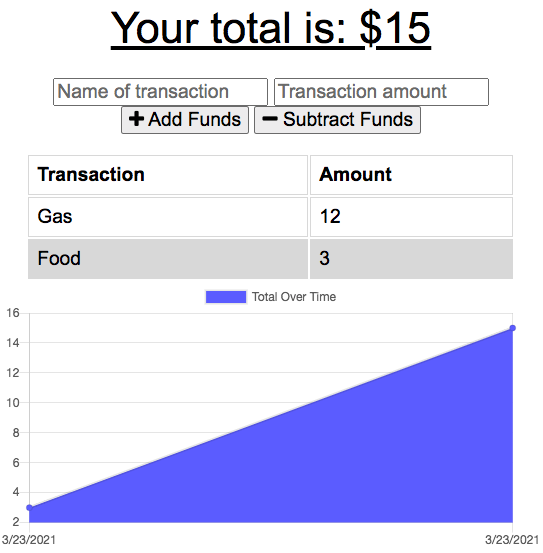

# Budget-Tracker

## Table of Contents
* [License](#license)
* [Description](#description)
* [URL](#url)
* [Installation](#installation)
* [Usage](#usage)
* [Tests](#tests)
* [Questions](#questions)

## Description 
The Budget Tracker was created with mongoose, javascript, html, and css, along with specific installations mentioned below. I think in the fitire it would be interesting to integrate this with a banking API. I have looked into the Bank of America API and would like to see it used in the further development of this app.

## URL
[Click here for a link to the live website](https://afternoon-thicket-71782.herokuapp.com/)

## Image

## Installation
npm i, mongoose, express

## Usage
This Progressive Budget Tracker is an open source for users to keep track of transactions they ake and how that affects their unique budgets. This application can be used offline and the datat will stay on the app itself when it is back online again so it can be used wherever and whenever the user needs it!

## Tests
No tests are required to run this application.

## Questions
Please contact me below with any questions you have about the appiction.
* Github: https://github.com/margaretelson
* Email: margaret.a.elson@gmail.com